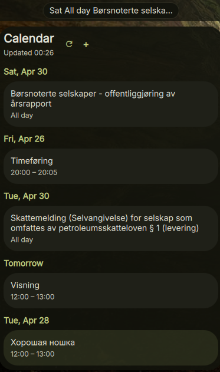

# DankCalendar

CalDAV calendar plugin for [DankMaterialShell](https://github.com/AvengeMedia/DankMaterialShell). Single Go binary, stdlib-only, keyring-only credentials.



## Commands

| Command | Description |
|---|---|
| `dankcalendar list` | List upcoming events |
| `dankcalendar calendars` | Discover available calendars |
| `dankcalendar add` | Create a new event |
| `dankcalendar edit` | Modify an existing event |
| `dankcalendar delete` | Delete an event |
| `dankcalendar notify` | Send desktop notifications for upcoming events |
| `dankcalendar setup` | Configure CalDAV credentials |

## Installation

### Nix (flake)

Add as a `flake = false` input and include in your DMS plugin configuration:

```nix
inputs.dms-plugin-calendar = {
  url = "github:alcxyz/DankCalendar";
  flake = false;
};
```

```nix
programs.dank-material-shell.plugins.DankCalendar = {
  enable = true;
  src = inputs.dms-plugin-calendar;
};
```

### Manual

1. Build the binary and place it in PATH:
   ```sh
   go build -o dankcalendar ./cmd/dankcalendar
   cp dankcalendar ~/.local/bin/
   ```

2. Copy the plugin directory to DMS:
   ```sh
   cp -r . ~/.config/DankMaterialShell/plugins/DankCalendar/
   ```

3. Configure your CalDAV account in DMS plugin settings, or run:
   ```sh
   dankcalendar setup
   ```

## Build

```sh
go build -o dankcalendar ./cmd/dankcalendar
```

## Design

- **Single binary** — no Python, no submodules
- **Stdlib-only** — no external Go dependencies
- **Keyring-only** — passwords stored via `secret-tool`, never in config files
- **Security by default** — HTTPS-only, ICS escaping, path traversal protection, `0600` config
- **JSON output** — one JSON object per command on stdout, errors on stderr

See [docs/adr/](docs/adr/) for architectural decision records.

## Dependencies

- **Build**: Go 1.22+
- **Runtime**: `secret-tool` (libsecret), `notify-send` (libnotify)

## License

MIT

<details>
<summary>Support</summary>

- **BTC:** `bc1pzdt3rjhnme90ev577n0cnxvlwvclf4ys84t2kfeu9rd3rqpaaafsgmxrfa`
- **ETH / ERC-20:** `0x2122c7817381B74762318b506c19600fF8B8372c`
</details>
