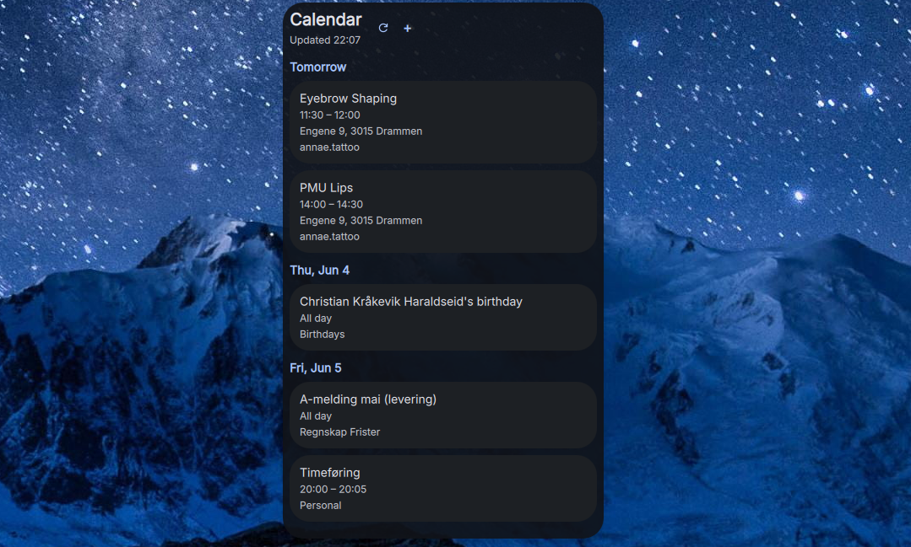

# DankCalendar

CalDAV calendar plugin for [DankMaterialShell](https://github.com/AvengeMedia/DankMaterialShell). Single Go binary, stdlib-only, keyring-only credentials.



## Commands

| Command | Description |
|---|---|
| `dankcalendar list` | List upcoming events |
| `dankcalendar calendars` | Discover available calendars |
| `dankcalendar add` | Create a new event |
| `dankcalendar edit` | Modify an existing event |
| `dankcalendar delete` | Delete an event |
| `dankcalendar notify` | Send desktop notifications for upcoming events |
| `dankcalendar setup` | Configure CalDAV credentials |
| `dankcalendar google-discover` | Authorize and discover Google calendars |

## Installation

### Nix (flake)

Add as a `flake = false` input and include in your DMS plugin configuration:

```nix
inputs.dms-plugin-calendar = {
  url = "github:alcxyz/DankCalendar";
  flake = false;
};
```

```nix
programs.dank-material-shell.plugins.dankCalendar = {
  enable = true;
  src = inputs.dms-plugin-calendar;
};
```

### Manual

1. Build the binary and place it in PATH:
   ```sh
   go build -o dankcalendar ./cmd/dankcalendar
   cp dankcalendar ~/.local/bin/
   ```

2. Copy the plugin directory to DMS:
   ```sh
   cp -r . ~/.config/DankMaterialShell/plugins/DankCalendar/
   ```

3. Configure your CalDAV account in DMS plugin settings, or run:
   ```sh
   dankcalendar setup
   ```

### Google Workspace / OAuth

Google Workspace requires OAuth 2.0 for CalDAV. Basic auth and app-specific passwords return `401 Unauthorized` on Google's current CalDAV endpoint.

DankCalendar does not provide a hosted or shared Google OAuth application. Each user supplies their own Google Cloud OAuth desktop client for their own Google account or Workspace. If Google shows `dankcalendar has not completed the Google verification process`, that message refers to the OAuth app in the user's Google Cloud project. For a personal/test setup, add the Google account under the OAuth consent screen's test users. For a public app, complete Google's OAuth verification.

To add Google calendars:

1. Create a Google OAuth desktop client ID in Google Cloud Console and enable the Google Calendar API.
2. Run:
   ```sh
   dankcalendar google-discover --account you@example.com --client-id YOUR_CLIENT_ID.apps.googleusercontent.com
   ```
3. Complete the browser authorization flow. DankCalendar stores the refresh token in the system keyring and writes discovered calendars to the normal config file.

Discovered Google calendars use Google's CalDAV endpoint with OAuth bearer-token authentication. Event listing, creation, editing, and deletion still use DankCalendar's CalDAV backend.

## Build

```sh
go build -o dankcalendar ./cmd/dankcalendar
```

## Design

- **Single binary** — no Python, no submodules
- **Stdlib-only** — no external Go dependencies
- **Keyring-only** — passwords stored via `secret-tool`, never in config files
- **Google Workspace support** — OAuth setup with Google Calendar discovery and CalDAV event operations
- **Security by default** — HTTPS-only, ICS escaping, path traversal protection, `0600` config
- **JSON output** — one JSON object per command on stdout, errors on stderr
- **Timezone-aware** — events from all calendars normalised to the configured timezone for correct cross-calendar sorting
- **Recurring events** — server-side expansion via CalDAV `<expand>` with client-side RRULE fallback for subscribed calendars

See [docs/adr/](docs/adr/) for architectural decision records.

## Dependencies

- **Build**: Go 1.22+
- **Runtime**: `secret-tool` (libsecret), `notify-send` (libnotify)

## License

MIT

<details>
<summary>Support</summary>

- **BTC:** `bc1pzdt3rjhnme90ev577n0cnxvlwvclf4ys84t2kfeu9rd3rqpaaafsgmxrfa`
- **ETH / ERC-20:** `0x2122c7817381B74762318b506c19600fF8B8372c`
</details>
